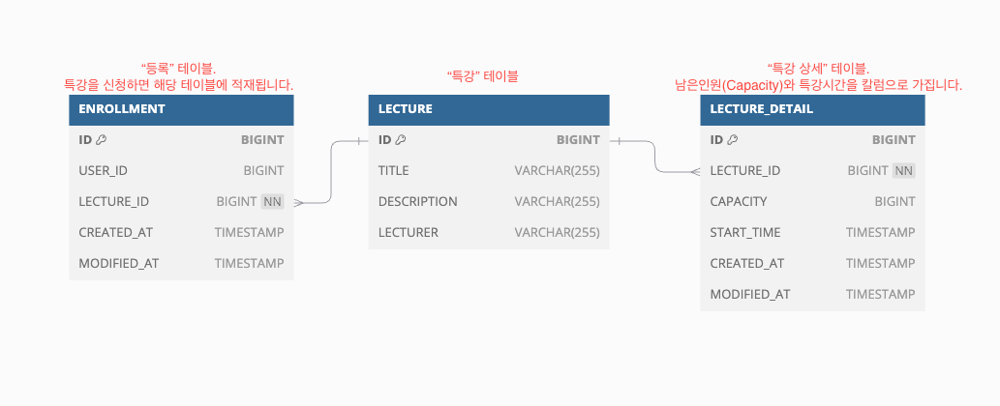

<h1>[STEP3] - 설계한 테이블에 대한 ERD, 이유를 설명</h1>



<h2>ERD의 테이블</h2>
<li>Lecture 테이블</li> 특강의 기본 정보를 관리합니다.
<li>Enrollment 테이블</li> 사용자의 수강 신청 기록을 관리하며, 동일한 사용자의 중복 신청을 방지합니다.
<li>Lecture 테이블</li> 특강의 시간대별 세부 정보와 남은 인원 관리를 통해 동시성 이슈를 해결합니다.

제가 설계한 ERD는 Lecture, LectureDetail, Enrollment 총 세 개의 주요 테이블로 구성되어 있습니다.
<br>유저를 따로 관리하는 API가 과제 구현 사항에 없어, User 테이블은 설계하지 않았습니다.

<h3>Lecture와 LectureDetail을 분리한 이유</h3>
정규화 과정에서, Lecture,LectureDetail을 분리하였습니다. 예를 들어, Lecture 한 테이블에 특강의 모든 정보가 담겨있다면, 특강의 강사 이름이 바뀌었을 경우, 해당하는 row의 모든 강사 이름을 바꾸어야 할 수 있습니다.
<br> 위와 같은 부분에서, 데이터의 중복을 방지하며, 유지보수에 용이하게 하기 위해 2차 정규형(2NF)를 충족하기 위한 설계를 하였습니다.

<h3>Enrollment 테이블의 중복방지</h3>
서버 단에서, USER_ID와 LECTURE_ID가 중복된 값이 적재되지 않게 처리를 하였지만, 추가적으로 DB단에서도 중복된 값이 적재되지 않도록 <b>유일성 제약 조건을</b> 추가하였습니다.
```
@Table(name = "ENROLLMENT",
    uniqueConstraints = {@UniqueConstraint(columnNames = {"userId", "lecture_id"})})
```
위와 같이, 테이블 레벨에서 uniqueConstraints 속성을 사용하여 유일성 제약을 설정하였습니다.

